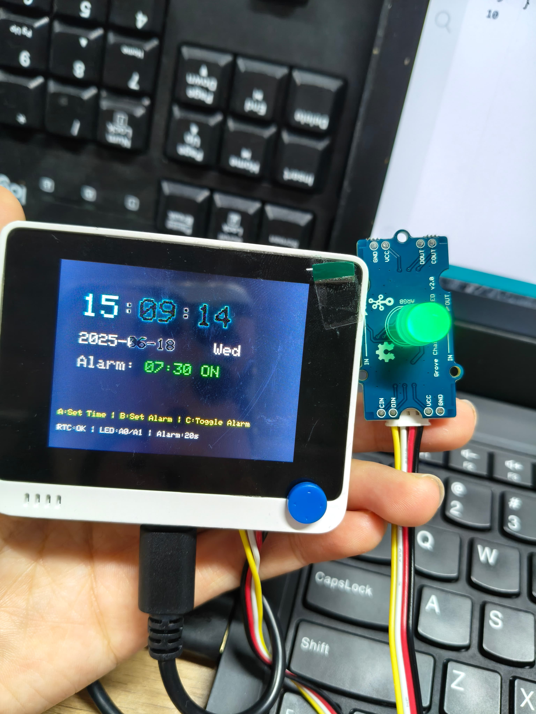
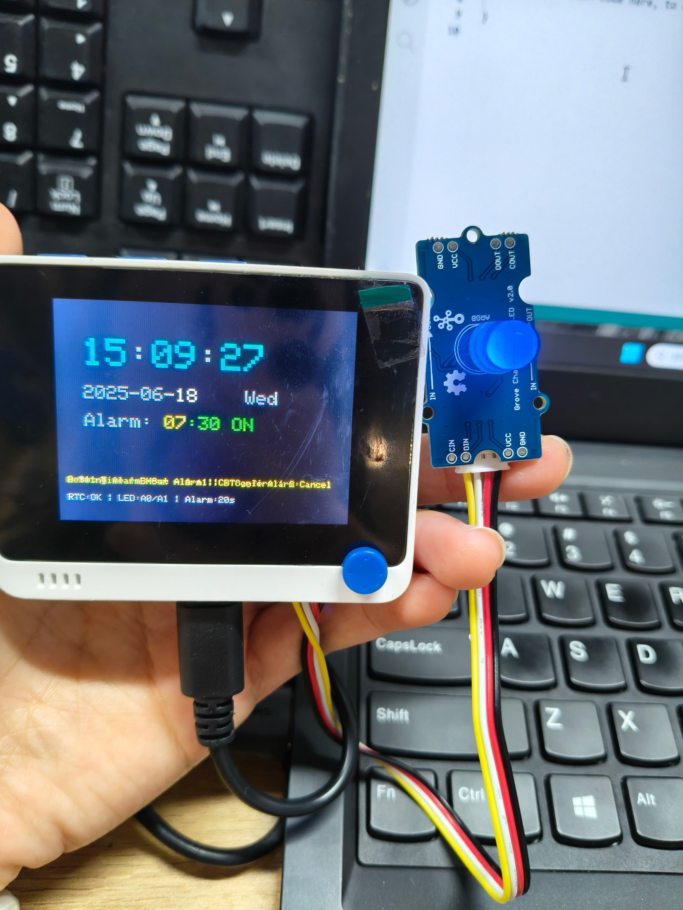
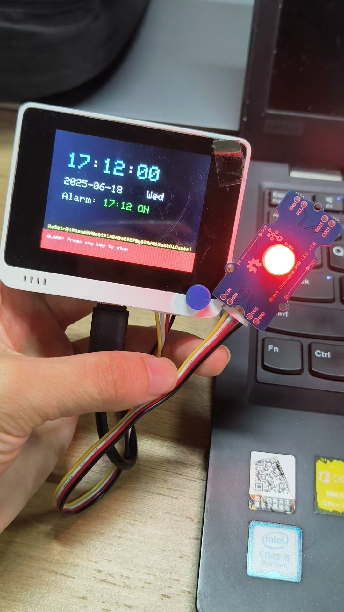
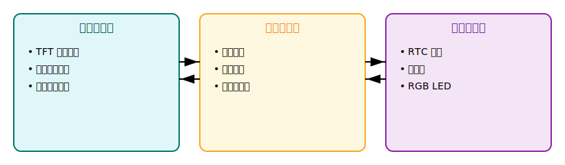

# Wio Terminal 智能闹钟项目

一个基于Seeed Wio Terminal开发的功能完整的智能闹钟系统，具备时间显示、闹钟设置、音响提醒和LED视觉提醒功能。

## 🌟 项目特性

- **实时时钟显示**：显示当前时间、日期和星期
- **手动时间设置**：支持小时和分钟的独立调节
- **智能闹钟系统**：可设置闹钟时间并支持开关控制
- **多重提醒方式**：
  - 🔊 音响提醒：播放"小星星"旋律20秒
  - 💡 LED视觉提醒：红色闪烁警示
- **用户友好界面**：彩色TFT显示屏，直观的操作提示
- **离线运行**：无需网络连接，完全独立工作

## 🛠️ 硬件需求

### 主要组件
- **Seeed Wio Terminal** × 1
- **Grove Chainable RGB LED** × 1  
- **Grove连接线** × 1

### 硬件连接

| Grove Chainable RGB LED | Wio Terminal |
|-------------------------|--------------|
| CLK (时钟线)              | A0           |
| DATA (数据线)             | A1           |
| VCC                     | 3.3V         |
| GND                     | GND          |

## 📚 软件依赖

### Arduino IDE库依赖
在Arduino IDE库管理器中安装以下库：

1. **[Seeed Arduino rpcWiFi](https://wiki.seeedstudio.com/Wio-Terminal-Wi-Fi/)** - Wio Terminal WiFi支持
2. **[Seeed Arduino rpcUnified](https://github.com/Seeed-Studio/Seeed_Arduino_rpcUnified)** - 统一外设接口  
3. **[TFT_eSPI](https://github.com/Seeed-Studio/Seeed_Arduino_LCD)** - TFT屏幕驱动
4. **[RTC library for SAMD51](https://wiki.seeedstudio.com/Wio-Terminal-RTC/)** - 实时时钟支持
5. **[millisDelay](https://github.com/ansonhex/millisDelay)** - 定时器功能
6. **[ChainableLED](https://wiki.seeedstudio.com/Grove-Chainable_RGB_LED/#play-with-arduino)** - Grove RGB LED控制

### 开发环境配置
- Arduino IDE 1.8.x 或更高版本
- 开发板选择：`Seeeduino SAMD Boards` → `Seeeduino Wio Terminal`

## 🚀 安装步骤

### 步骤 1：环境准备
1. 下载并安装 [Arduino IDE](https://www.arduino.cc/en/software)
2. 在Arduino IDE中添加Seeed开发板支持：
   - 文件 → 首选项 → 附加开发板管理器网址
   - 添加：`https://files.seeedstudio.com/arduino/package_seeeduino_boards_index.json`
3. 工具 → 开发板 → 开发板管理器，搜索并安装"Seeed SAMD Boards"

### 步骤 2：库安装
在Arduino IDE中：工具 → 管理库，搜索并安装上述所有依赖库

### 步骤 3：硬件连接
按照上述接线表连接Grove Chainable RGB LED到Wio Terminal

### 步骤 4：代码上传
1. 将项目代码复制到Arduino IDE
2. 选择正确的开发板和端口
3. 编译并上传代码到设备

## 🎮 使用说明

### 操作模式

#### 正常模式
- **按键A**：进入时间设置模式
- **按键B**：进入闹钟设置模式  
- **按键C**：开关闹钟功能

#### 设置模式
- **按键A**：增加数值（小时/分钟）
- **按键B**：确认当前设置，进入下一步
- **按键C**：取消设置，返回正常模式

### 设置流程

#### 时间设置
1. 正常模式下按**A键**进入时间设置
2. 按**A键**调整小时，按**B键**确认
3. 按**A键**调整分钟，按**B键**完成设置

#### 闹钟设置  
1. 正常模式下按**B键**进入闹钟设置
2. 按**A键**调整闹钟小时，按**B键**确认
3. 按**A键**调整闹钟分钟，按**B键**完成设置

### LED状态指示
- **绿色微光**：正常模式运行中

  

- **蓝色微光**：设置模式中

  

- **红色闪烁**：闹钟响起

  

## 🔧 技术实现原理

### 系统架构



### 核心模块实现

#### 1. 实时时钟 (RTC)
```cpp
// RTC初始化和时间同步
RTC_SAMD51 rtc;
DateTime compileTime = DateTime(F(__DATE__), F(__TIME__));
rtc.adjust(compileTime);
```

**实现原理**：
- 使用Wio Terminal内置的SAMD51 RTC模块
- 程序启动时自动设置为编译时间
- 支持手动时间调整功能

#### 2. 状态机控制
```cpp
enum TimeMode {
  NORMAL_MODE,           // 正常显示模式
  SET_HOUR_MODE,         // 设置小时模式  
  SET_MINUTE_MODE,       // 设置分钟模式
  SET_ALARM_HOUR_MODE,   // 设置闹钟小时
  SET_ALARM_MINUTE_MODE  // 设置闹钟分钟
};
```

**实现原理**：
- 使用枚举定义系统运行状态
- 根据当前状态响应不同的按键操作
- 10秒无操作自动返回正常模式

#### 3. 闹钟系统
```cpp
void triggerAlarm() {
  unsigned long alarmStartTime = millis();
  const unsigned long alarmDuration = 20000; // 20秒
  
  while (millis() - alarmStartTime < alarmDuration) {
    // 音乐播放循环
    // LED闪烁控制  
    // 按键中断检测
  }
}
```

**实现原理**：
- 非阻塞式闹钟实现，支持按键中断
- 音乐循环播放"小星星"旋律
- LED每500ms红色闪烁一次
- 20秒自动停止或按键手动停止

#### 4. LED视觉提醒
```cpp
ChainableLED leds(LED_CLK_PIN, LED_DATA_PIN, NUM_LEDS);

// 状态指示
leds.setColorRGB(0, 0, 10, 0);    // 正常模式：绿色微光
leds.setColorRGB(0, 0, 0, 10);    // 设置模式：蓝色微光  
leds.setColorRGB(0, 255, 0, 0);   // 闹钟模式：红色闪烁
```

**实现原理**：
- 使用ChainableLED库控制Grove RGB LED
- 通过不同颜色表示系统状态
- 闪烁效果通过定时切换实现

#### 5. 用户界面
```cpp
void displayTime(DateTime now) {
  // 根据当前模式高亮显示对应数字
  if (currentMode == SET_HOUR_MODE) {
    tft.setTextColor(TFT_YELLOW);  // 黄色高亮
  } else {
    tft.setTextColor(TFT_CYAN);    // 正常青色
  }
}
```

**实现原理**：
- TFT屏幕分区域显示不同信息
- 当前设置项使用黄色高亮
- 底部显示操作提示和系统状态

### 按键防抖处理
```cpp
void handleButtons() {
  static unsigned long lastDebounce = 0;
  if (millis() - lastDebounce < 200) return;
  
  if (digitalRead(BUTTON_A) == LOW) {
    tone(BUZZER_PIN, 1000, 50); // 按键音效反馈
    handleButtonA();
    lastDebounce = millis();
  }
}
```

**实现原理**：
- 200ms防抖时间避免误触
- 按键音效提供操作反馈
- 静态变量记录上次按键时间

## 🎵 音乐播放实现

### 旋律数据结构
```cpp
char notes[] = "ccggaagffeeddc ";  // 音符序列
int beats[] = { 1, 1, 1, 1, 1, 1, 2, 1, 1, 1, 1, 1, 1, 2, 4 }; // 节拍
int tempo = 300;  // 节拍时长(ms)
```

### 频率映射表
| 音符 | 频率(Hz) |
|------|----------|
| c    | 261      |
| d    | 294      |
| e    | 329      |
| f    | 349      |
| g    | 392      |
| a    | 440      |
| b    | 493      |


## 📊 内存使用优化

### 编译信息
- **程序存储空间**：约85KB / 496KB (17%)
- **动态内存**：约12KB / 192KB (6%)
- **Flash使用率**：低，有充足扩展空间

### 优化策略
1. **高效的状态管理**：使用枚举减少内存占用
2. **局部变量优化**：避免全局变量滥用
3. **字符串常量**：使用F()宏存储在Flash中
4. **定时器优化**：使用millisDelay库替代delay()

## 🔍 故障排除

### 常见问题

#### 1. 编译错误
**问题**：缺少库文件
**解决**：确保安装所有必需的库文件

#### 2. RTC时间不准确
**问题**：显示编译时间
**解决**：手动设置当前时间

#### 3. LED不亮
**问题**：接线错误或库未安装
**解决**：
- 检查A0/A1引脚连接
- 确认ChainableLED库已安装

#### 4. 按键无响应
**问题**：防抖时间过长
**解决**：检查串口监视器输出，确认按键信号

## 📈 扩展功能

### 可能的改进方向
1. **多闹钟支持**：支持设置多个闹钟
2. **闹钟铃声选择**：提供不同的音乐选项
3. **温湿度显示**：集成环境传感器
4. **WiFi时间同步**：自动网络对时功能
5. **数据存储**：EEPROM保存设置

### 代码模块化
当前代码结构便于扩展：
- 独立的显示函数
- 模块化的按键处理
- 分离的硬件控制逻辑

## 📖 参考文档

本项目开发过程中参考了以下官方文档：

1. [Wio Terminal快速开始指南](https://wiki.seeedstudio.com/Wio-Terminal-Getting-Started/)
2. [Wio Terminal LCD显示屏使用](https://wiki.seeedstudio.com/Wio-Terminal-LCD-Overview/)  
3. [Wio Terminal RTC实时时钟](https://wiki.seeedstudio.com/Wio-Terminal-RTC/)
4. [Wio Terminal蜂鸣器使用](https://wiki.seeedstudio.com/Wio-Terminal-Buzzer/)
5. [Grove Chainable RGB LED](https://wiki.seeedstudio.com/Grove-Chainable_RGB_LED/)

## 📄 开源协议

本项目采用 MIT 开源协议，欢迎贡献代码和提出改进建议。

## 👨‍💻 作者信息: Karina Xie

如有问题或建议，欢迎通过GitHub Issues联系。

---

**注意**：首次使用时，请确保所有硬件连接正确，并在Arduino IDE串口监视器中查看调试信息。
